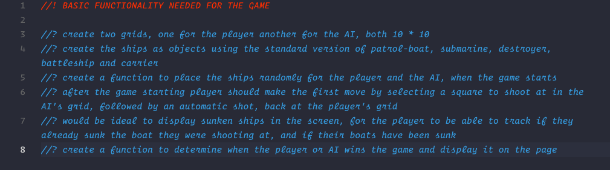
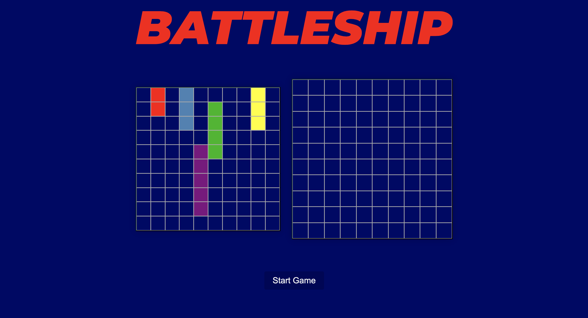

# sei project 1 - Battleship

## Index
* [Overview](#overview)
* [Setup](#setup)
* [Technologies Used](#technologies-used)
* [Approach](#approach)
  * [Explanations](#explanations)
  * [Thoughts](#thoughts)
* [Notable Bugs](#notable-bugs)
* [Conclusion](#conclusion)
	* [Wins and Challenges](#wins-and-challenges)
	* [Some Learnings](#some-learnings)


## Overview 

For my first project in General Assembly's Software Engineering course our task was to develop a game within a week using HTML, CSS and Javascript, we were given a few options of which I chose the Battleship game.

Battleship is a strategy-guessing game made for two players. Both players have a grid with their fleets made of 4 or 5 ships that are concealed to each other. The objective of the game is to destroy each others fleet for which the players alternate turns calling shots at the other player's grid.

Also wanted to add that I will not be editing the code mainly because right now the purpose it serves its being the first project that I ever did and its showcasing the skills I had with 3 weeks into coding and changing that would serve no purpose for me.

## Setup

First we need to download the repository into our own machine for which we have to input the following line into our terminal or command line:
```bash 
git clone https://github.com/DanielFDA/sei-project-1.git
```

then, to launch the game go the downloaded folder and double-click `index.html`

For this game there is no installation or requirements needed.

## Technologies Used
* CSS
* JavaScript (ES6)
* HTML5

## Approach

One thing to note is that for this project there is a lot of comments made in Spanish (which is my native language), I understand that I should've used English and in future projects I do.

In this section I will do my best to explain what the functions do and how the game works, if you choose you can skip the explanations and go straight to my thought process during the building of this game.

### Explanations

The first thing I did was write down all the core/main functionality that I thought was basic for the game to function, for this I had to go through the [Battleship](https://en.wikipedia.org/wiki/Battleship_(game)) wikipedia to make sure I wasn't missing anything, as well as deciding the amount of ships that I wanted for the game since they vary depending on the version of the game you choose to play.

<p align="center" width="100%">
     
</p>

This is how the ships objects looked

```js
const ships = [
    {
      name: 'patrol-boat',
      directions: [
        [0, 1],
        [0, width]
      ]
    },
    {
      name: 'submarine',
      directions: [
        [0, 1, 2],
        [0, width, width * 2]
      ]
    },
    {
      name: 'destroyer',
      directions: [
        [0, 1, 2],
        [0, width, width * 2]
      ]
    },
    {
      name: 'battleship',
      directions: [
        [0, 1, 2, 3],
        [0, width, width * 2, width * 3]
      ]
    },
    {
      name: 'carrier',
      directions: [
        [0, 1, 2, 3, 4],
        [0, width, width * 2, width * 3, width * 4]
      ]
    }
  ]
```

the directions property is the x and y axis that is later used in a function to place ships randomly 

```js
  function oceanGridShipsGenerator(ship) {
    let randomDirection = Math.floor(Math.random() * ship.directions.length) // te devuelve un valor random 0 o 1
    let current = ship.directions[randomDirection] // elige una de las dos direcciones q tiene el array
    let direction  // se usa para luego multiplicar dependiendo de si es horizontal o vertical
    if (randomDirection === 0) direction = 1
    if (randomDirection === 1) direction = 10
    let randomStart = Math.abs(Math.floor(Math.random() * oceanGridCells.length - (ship.directions[0].length * direction)))  // agarra una cell random del oceangrid y le resta el largo de las direcciones del barco q va a crear (multiplicado por la direccion(horizontal o vertical)) ej: un destroyer seria 36 - (3 * 1(si es horizontal) o 10(si es vertical)) en el caso de ser vertical tienes 36 - 3*10 = 6, la primera posicion del barco seria la cell numero 6

    const isTaken = current.some(index => oceanGridCells[randomStart + index].classList.contains('cellTaken')) // esta funcion se encarga de revisar si la random cell ya tiene asignada la clase de cellTaken
    const isAtRightEdge = current.some(index => (randomStart + index) % width > width - 1) // esta funcion se encarga de buscar tu cell de inicio e irle agregando todas las cells del barco y comprobando q esten en el borde derecho. ej: randomStart(36) + index(depende de las vidas del barco y de si es horizontal(0,1,2) o vertical(0,width,width*2) ) en el caso del destroyer seria 36+0)%10 = 6 === 9; 36+1)%10 = 7 === 9; 36+2) %10 = 8 === 9. // ! lo cambie para que sea menor enves de estrictamente igual, de esta manera pueden aparecer barcos en la ultima fila de la derecha, pero no logro hacer que puedan aparecer tambien en la de la izquierda porque me genera un error que hace q los barcos salgan desde un extremo de una linea hasta el otro extremo en la siguiente linea
    const isAtLeftEdge = current.some(index => (randomStart + index) % width === 0) // lo mismo de arriba solo que para el lado izquierdo 

    if (!isTaken && !isAtRightEdge && !isAtLeftEdge) current.forEach(index => oceanGridCells[randomStart + index].classList.add('cellTaken', ship.name)) // se asegura q todos los casos anteriores sean falsos para agregar randommente los barcos y agregarles dos clases una de celltaken y otra con su nombre

    else oceanGridShipsGenerator(ship)
  }
  oceanGridShipsGenerator(ships[0])
  oceanGridShipsGenerator(ships[1])
  oceanGridShipsGenerator(ships[2])
  oceanGridShipsGenerator(ships[3])
  oceanGridShipsGenerator(ships[4])
```

What this function does is randomly choose one of the directions array's and use it to randomly generate a ship in the ocean grid (player's grid) taking into account the length of the ship and that it cannot jump either horizontal or vertical edges in order to place them (so a ship wouldn't be able to being in the end of a row and start in the next one, the same way that it couldn't start in the bottom of the grid and finish in the top or viceversa).

Then had to make another very similar function for the AI's grid.

And afterwards then fun began having to make the player's turn function, will explain below
```js
  function playersTurn(classList) {
    const cellUnderFire = trackingGrid.querySelector(`div[data-id='${cellId}']`)
    const obj = Object.values(classList)
    if (!cellUnderFire.classList.contains('hit') && turn === true && !gameOver) {
      if (obj.includes('patrol-boat')) AIpatrolBoatCount--
      if (obj.includes('submarine')) AIsubmarineCount--
      if (obj.includes('destroyer')) AIdestroyerCount--
      if (obj.includes('battleship')) AIbattleshipCount--
      if (obj.includes('carrier')) AIcarrierCount--
      // console.log(`patrol has ${AIpatrolBoatCount} lives left`)
      // console.log(`submarine has ${AIsubmarineCount} lives left`)
      // console.log(`destroyer has ${AIdestroyerCount} lives left`)
      // console.log(`battleship has ${AIbattleshipCount} lives left`)
      // console.log(`carrier has ${AIcarrierCount} lives left`)
    }
    if (obj.includes('cellTakenByAI')) {
      cellUnderFire.classList.add('hit')
    } else {
      cellUnderFire.classList.add('miss')
    }
    if (obj.includes('hit')) {
      alert('You alredy shot this cell. Please try another')
      return
    }
    if (obj.includes('miss')) {
      alert('You alredy shot this cell. Please try another')
      return
    }
    winConditions()
    turn = false
    playGame()
  }

```

This is when bugs started happening and also ways to cheat, for this function to work I had to give all the divs inside both grids a class depending on wether they had a ship in it or not, which can be easily checked on the dev tools > elements tab. 

This function works in compliance with the playGame function that you'll see next, what it does is check the div that it's being clicked by the player to see wether or not there is a ship in it and depending on that it changes the class of the div that has been clicked to "hit" or "miss", then it checks if it alredy has a class of hit or miss to alert the player and give him the chance to fire again, if it doesnt and it's a hit it checks if it had a class of any of the ships and will reduce the lives counter of that ship by one. In the end it runs the winsConditions function to check if with that shot they sunk the last AI's ship and won the game, if not playGame function will run.

```js
  function playGame() {
    if (gameOver) return
    if (turn === true) {
      trackingGridCells.forEach(cell => cell.addEventListener('click', function(e) {
        cellId = cell.dataset.id
        playersTurn(cell.classList)
      }))
    }
    if (turn === false) {
      setTimeout(aiTurn, 1000)
    }
  }
```
This function first will check if the gameover variable is true and if it is it'll stop running, then will check wether its the player's turn or the AI's and will run the appropiate function. In the case of the player it adds an event lsitener to all the divs so the function knows what div is being clicked and evaluates based on that.

For the AI it will just run the function after 1 second 
```js
  function aiTurn(cell) {
    cell = Math.floor(Math.random() * oceanGridCells.length)
    if (!oceanGridCells[cell].classList.contains('hit')) {
      const cellHit = oceanGridCells[cell].classList.contains('cellTaken')
      oceanGridCells[cell].classList.add(cellHit ? 'hit' : 'miss')
      if (oceanGridCells[cell].classList.contains('patrol-boat')) patrolBoatCount--
      if (oceanGridCells[cell].classList.contains('submarine')) submarineCount--
      if (oceanGridCells[cell].classList.contains('destroyer')) destroyerCount--
      if (oceanGridCells[cell].classList.contains('battleship')) battleshipCount--
      if (oceanGridCells[cell].classList.contains('carrier')) carrierCount--
      winConditions()
    } else aiTurn()
    turn = true
  }
```

This function works pretty similarly to how the player's one does, difference is that instead of evaluating the div that's being clicked, it will choose one randomly (I wanted to improve this to make the AI smarter but didn't have enough time, better explained in the Thoughts section.)

Now for the last big function we have the winConditions

```js
  function winConditions() {
    if (AIpatrolBoatCount === 0) {
      gameInfo.innerHTML = 'You have sunk AI\'s Patrol Boat'
    }
    if (AIsubmarineCount === 0) {
      gameInfo.innerHTML = 'You have sunk AI\'s Submarine'
    }
    if (AIdestroyerCount === 0) {
      gameInfo.innerHTML = 'You have sunk AI\'s Destroyer'
    }
    if (AIbattleshipCount === 0) {
      gameInfo.innerHTML = 'You have sunk AI\'s Battleship'
    }
    if (AIcarrierCount === 0) {
      gameInfo.innerHTML = 'You have sunk AI\'s Carrier'
    }
    if (patrolBoatCount === 0) {
      gameInfo.innerHTML = 'Your patrol boat has been sunk'
    }
    if (submarineCount === 0) {
      gameInfo.innerHTML = 'Your submarine has been sunk'
    }
    if (destroyerCount === 0) {
      gameInfo.innerHTML = 'Your destroyer has been sunk'
    }
    if (battleshipCount === 0) {
      gameInfo.innerHTML = 'Your battleship has been sunk'
    }
    if (carrierCount === 0) {
      gameInfo.innerHTML = 'Your carrier has been sunk'
    }
    if (AIpatrolBoatCount === 0 && AIsubmarineCount === 0 && AIdestroyerCount === 0 && AIbattleshipCount === 0 && AIcarrierCount === 0) {
      gameInfo.innerHTML = 'PLAYER WINS'
      alert('Player WINS')
      gameEnds()
    }
    if (patrolBoatCount === 0 && submarineCount === 0 && destroyerCount === 0 && battleshipCount === 0 && carrierCount === 0) {
      gameInfo.innerHTML = 'AI WINS'
      alert('AI WINS')
      gameEnds()
    }
  }
```

Like the name says this function will check all the win conditions in order to stop the game if they're true, for this it sums up all the lives counter of the ships and if it equals 0 it runs the gameEnds function. It's also responsible for displaying the sunk messages on the screen, for this it will display it if the counter of the ship reaches 0.

Now the gameEnds function and the last one of this project

```js
  function gameEnds() {
    gameOver = true
    removeEventListener('click', playGame)
  }
```

What this one does is set the gameOver variable to true and remove the event listener added by the playGame function, in order to stop the player from getting a response out of clicking other divs after the game has ended.

### Thoughts

For me this game was extremely challenging in terms of putting everything together, some bits of logic were aso very hard, the functions to create the ships (oceanGridShipsGenerator for example) were very tricky due to the special cases mentioned but were also quite fast because once that was cleared there was not really much holding back. 

Now as for the player's and AI's turn it became a little different because the functions worked together and were handled by another one and connecting all the dots took much longer for me, which were the main reason why I ran out time and couldn't work on the logic for the AI, as well as having close to no time to worry about the styling of the game. Which was really sad for me because I was enjoying CSS quite a bit but nonetheless I think I learned tons on this project, having only 3 weeks coding it was really mind blowing to me to have come up with the solutions for some of these functions, I'm completely aware that there is a lot of repeated code and refactoring would be great but like I said in the [Overview](#overview) it servers no purpose to me to fix it now, so I will be leaving everything as is and in the near future will do it all over again to get everything the way I thought about it the first time and may even come up with some new stuff.
## Notable Bugs

There are a handful of bugs in the game, most of which have no direct impact to the gameplay but some can be detrimental, theres 3 main ones:

#### Sunk Ships Message

The sunk ships message has a bug where after a certain amounts of lives it stops updating the messages, so the player has no easy way to track wether or not he sank a ship. 
#### Auto-generation of the Ships

There is a problem with the generator function for the ships where no ship is ever auto-generated on the first column of the grids.
#### Easy to cheat

Knowing how to use the basic functionality of the dev tools in any browser will allow the player to check where the AI's ships are located. This was because the way I used classes to identify everything easily.
## Conclusion

### Wins and Challenges

The biggest win I got from this project is learning how to manage my time properly as well as my expectations depending on a timeframe but also the fact that the methodologie you use and how well structured and organized you work will heavily impact the outcome and the amount of work you will get done in the same amount of time.

My biggest challenge was managing my time correctly, for this project I spent too much time in the beginning trying to go straight to coding when I had no base or sketch to work on, had everything on my mind but I didn't take the time to make a step by step process to follow, which would have saved me at least a couple of days but I consider it a lack of experience mistake which wouldn't happen again.

### Some Learnings

After three weeks of coding I went into my first project with quite a few doubts but very anxious to see what I would be able to develop within a week. So I kept the scope pretty simple to begin with taking into account that this was the first time that I would work on a project (plus being alone).

Since this was my first time developing a game, I had some trouble deciding where I should start and felt a little overwhelmed at first but thanks to the coaching and instructions given by the team at GA I started by picturing how I wanted my game to work and began making functions for the very basic things I needed like creating the grid for both the player and AI and placing ships inside randomly for both, then moving onto the more complex functions that would take care of the gameplay and both the player's and AI's inputs.

This methodologie helped me understand how to split big problems into smaller and manageable pieces that I can begin to work on in order to achieve a certain goal. At the end, despite the fact that I couldn't finish what I set myself to do, I was satisfied with the outcome and the fact that I enjoyed developing this game while learning a lot
</br>
</br>
<p align="center" width="100%">
     
</p>

[Index](#index)