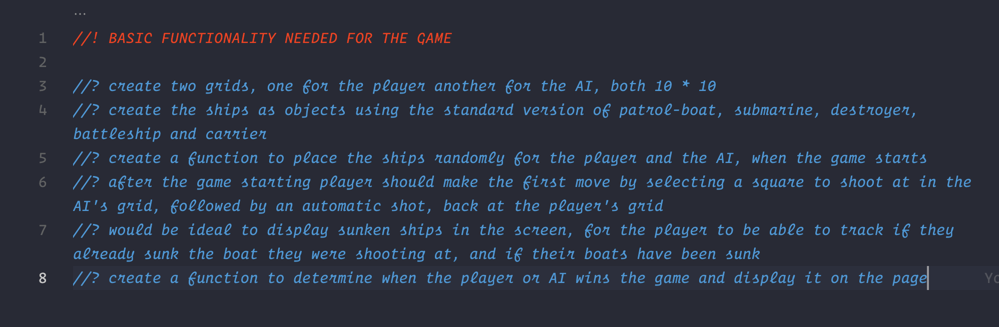

# sei project 1 - Battleship

## Index
* [Overview](#overview)
* [Setup](#setup)
* [Technologies Used](#technologies-used)
* [Approach](#approach)
* [Notable Bugs](#notable-bugs)
* [Conclusion](#conclusion)
	* [Wins and Challenges](#wins-and-challenges)
	* [Some Learnings](#some-learnings)


## Overview 

For my first project in General Assembly's Software Engineering course our task was to develop a game within a week using HTML, CSS and Javascript, we were given a few options of which I chose the Battleship game.

Battleship is a strategy-guessing game made for two players. Both players have a grid with their fleets made of 4 or 5 ships that are concealed to each other. The objective of the game is to destroy each others fleet for which the players alternate turns calling shots at the other player's grid.

Also wanted to add that I will not be editing the code mainly because right now the purpose it serves its being the first project that I ever did and its showcasing the skills I had with 3 weeks into coding and changing that would serve no purpose for me.

## Setup

First we need to download the repository into our own machine for which we have to input the following line into our terminal or command line:
```bash 
git clone https://github.com/DanielFDA/sei-project-1.git
```

then, to launch the game go the downloaded folder and double-click `index.html`

For this game there is no installation or requirements needed.

## Technologies Used
* CSS
* JavaScript (ES6)
* HTML5

## Approach

The first thing I did was write down all the core/main functionality that I thought was basic for the game to function, for this I had to go through the [Battleship](https://en.wikipedia.org/wiki/Battleship_(game)) wikipedia to make sure I wasn't missing anything, as well as deciding the amount of ships that I wanted for the game since they vary depending on the version of the game that you play.

<p align="center" width="100%">
     
</p>
## Notable Bugs

These were the most important bugs I found while testing the game

#### Sunk Ships Message
The message displayed on the screen stops updating after a certain amount of lives taken from the ships

#### Ships generation
No ship is ever auto-generated on the first column

## Conclusion

### Wins and Challenges

The biggest win I got from this project is learning how to manage my time properly as well as my expectations depending on a timeframe but also the fact that the methodologie you use and how well structured and organized you work will heavily impact the outcome and the amount of work you will get done in the same amount of time.

My biggest challenge was managing my time correctly, for this project I spent too much time in the beginning trying to go straight to coding when I had no base or sketch to work on, had everything on my mind but I didn't take the time to make a step by step process to follow, which would have saved me at least a couple of days but I consider it a lack of experience mistake which wouldn't happen again.

### Some Learnings

After three weeks of coding I went into my first project with quite a few doubts but very anxious to see what I would be able to develop within a week. So I kept the scope pretty simple to begin with taking into account that this was the first time that I would work on a project (plus being alone).

Since this was my first time developing a game, I had some trouble deciding where I should start and felt a little overwhelmed at first but thanks to the coaching and instructions given by the team at GA I started by picturing how I wanted my game to work and began making functions for the very basic things I needed like creating the grid for both the player and AI and placing ships inside randomly for both, then moving onto the more complex functions that would take care of the gameplay and both the player's and AI's inputs.

This methodologie helped me understand how to split big problems into smaller and manageable pieces that I can begin to work on in order to achieve a certain goal. At the end, despite the fact that I couldn't finish what I set myself to do, I was satisfied with the outcome and the fact that I enjoyed developing this game while learning a lot

[Index](#index)